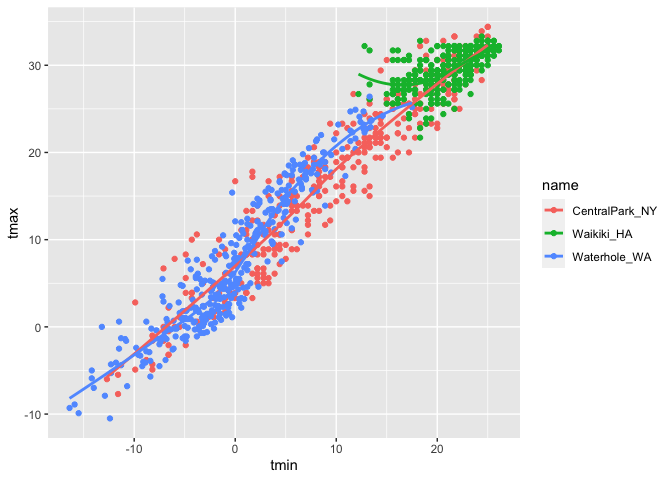
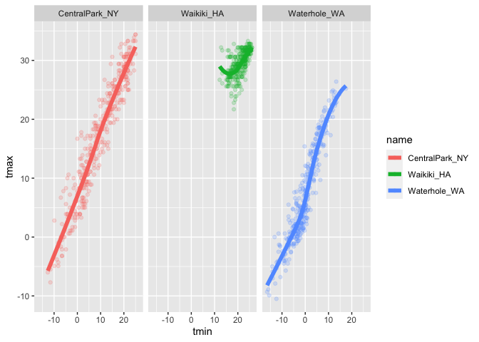
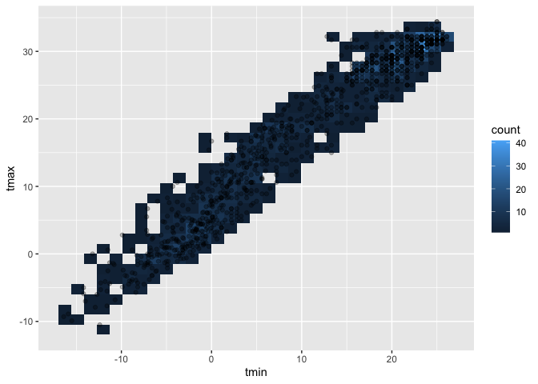
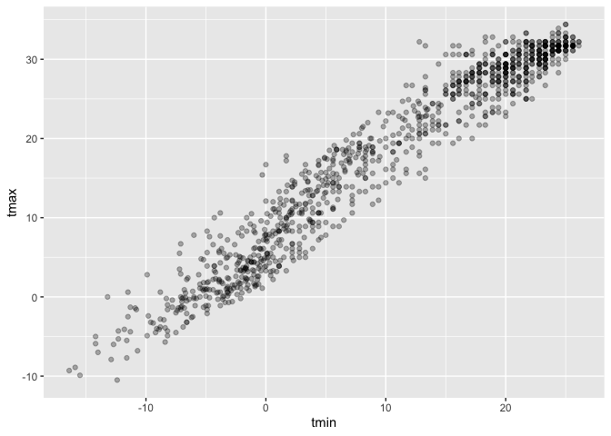
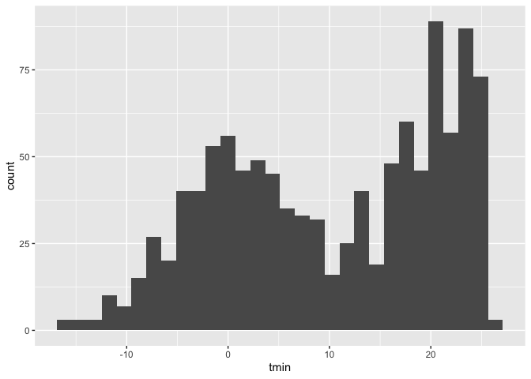
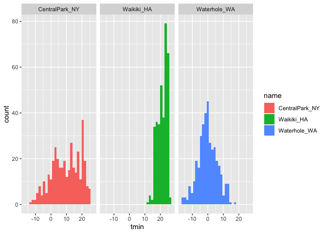
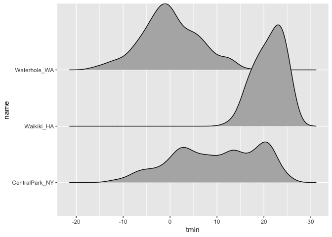
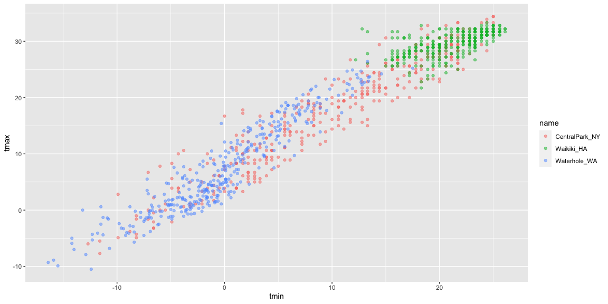

Visualization with ggplot pt. 1
================

``` r
library(tidyverse)
```

    ## ── Attaching packages ────────────────────────────────────────────────────── tidyverse 1.3.0 ──

    ## ✓ ggplot2 3.3.2     ✓ purrr   0.3.4
    ## ✓ tibble  3.0.3     ✓ dplyr   1.0.2
    ## ✓ tidyr   1.1.2     ✓ stringr 1.4.0
    ## ✓ readr   1.3.1     ✓ forcats 0.5.0

    ## ── Conflicts ───────────────────────────────────────────────────────── tidyverse_conflicts() ──
    ## x dplyr::filter() masks stats::filter()
    ## x dplyr::lag()    masks stats::lag()

``` r
library(ggridges)
```

## Load the weather dataset

``` r
weather_df = 
  rnoaa::meteo_pull_monitors(
    c("USW00094728", "USC00519397", "USS0023B17S"),
    var = c("PRCP", "TMIN", "TMAX"), 
    date_min = "2017-01-01",
    date_max = "2017-12-31") %>%
  mutate(
    name = recode(
      id, 
      USW00094728 = "CentralPark_NY", 
      USC00519397 = "Waikiki_HA",
      USS0023B17S = "Waterhole_WA"),
    tmin = tmin / 10,
    tmax = tmax / 10) %>%
  select(name, id, everything())
```

    ## Registered S3 method overwritten by 'hoardr':
    ##   method           from
    ##   print.cache_info httr

    ## using cached file: /Users/rebekahhughes/Library/Caches/R/noaa_ghcnd/USW00094728.dly

    ## date created (size, mb): 2020-10-03 09:23:25 (7.522)

    ## file min/max dates: 1869-01-01 / 2020-10-31

    ## using cached file: /Users/rebekahhughes/Library/Caches/R/noaa_ghcnd/USC00519397.dly

    ## date created (size, mb): 2020-10-03 09:23:31 (1.699)

    ## file min/max dates: 1965-01-01 / 2020-03-31

    ## using cached file: /Users/rebekahhughes/Library/Caches/R/noaa_ghcnd/USS0023B17S.dly

    ## date created (size, mb): 2020-10-03 09:23:34 (0.88)

    ## file min/max dates: 1999-09-01 / 2020-10-31

## Scatterplots

Create my first scatterplot:

``` r
ggplot(weather_df, aes(x = tmin, y = tmax)) + 
  geom_point()
```

    ## Warning: Removed 15 rows containing missing values (geom_point).

<!-- -->

New approach, same plot:

``` r
weather_df %>% 
  ggplot(aes(x = tmin, y = tmax)) +
  geom_point()
```

    ## Warning: Removed 15 rows containing missing values (geom_point).

<!-- -->

Save and edit plot object:

``` r
weather_plot =
  weather_df %>% 
  ggplot(aes(x = tmin, y = tmax))

weather_plot + geom_point()
```

    ## Warning: Removed 15 rows containing missing values (geom_point).

<!-- -->

## Advanced scatterplot

Start with the same plot and make it fancy

``` r
weather_df %>% 
  ggplot(aes(x = tmin, y = tmax, color = name)) +
  geom_point() + 
  geom_smooth(se = FALSE)
```

    ## `geom_smooth()` using method = 'loess' and formula 'y ~ x'

    ## Warning: Removed 15 rows containing non-finite values (stat_smooth).

    ## Warning: Removed 15 rows containing missing values (geom_point).

<!-- -->

What about the `aes` placement?

``` r
weather_df %>% 
  ggplot(aes(x = tmin, y = tmax)) +
  geom_point(aes(color = name)) +
  geom_smooth()
```

    ## `geom_smooth()` using method = 'gam' and formula 'y ~ s(x, bs = "cs")'

    ## Warning: Removed 15 rows containing non-finite values (stat_smooth).

    ## Warning: Removed 15 rows containing missing values (geom_point).

<!-- -->

Facet some things:

``` r
weather_df %>% 
  ggplot(aes(x = tmin, y = tmax, alpha = tmin, color = name)) +
  geom_point() + 
  geom_smooth(se = FALSE) +
  facet_grid(. ~ name)
```

    ## `geom_smooth()` using method = 'loess' and formula 'y ~ x'

    ## Warning: Removed 15 rows containing non-finite values (stat_smooth).

    ## Warning: Removed 15 rows containing missing values (geom_point).

<!-- -->

``` r
weather_df %>% 
  ggplot(aes(x = tmin, y = tmax, color = name)) +
  geom_point(alpha = .2) + 
  geom_smooth(se = FALSE) +
  facet_grid(. ~ name)
```

    ## `geom_smooth()` using method = 'loess' and formula 'y ~ x'

    ## Warning: Removed 15 rows containing non-finite values (stat_smooth).
    
    ## Warning: Removed 15 rows containing missing values (geom_point).

<!-- -->

``` r
weather_df %>% 
  ggplot(aes(x = tmin, y = tmax, color = name)) +
  geom_point(alpha = .2) + 
  geom_smooth(se = FALSE, size = 2) +
  facet_grid(. ~ name)
```

    ## `geom_smooth()` using method = 'loess' and formula 'y ~ x'

    ## Warning: Removed 15 rows containing non-finite values (stat_smooth).
    
    ## Warning: Removed 15 rows containing missing values (geom_point).

<!-- -->

Combine some elements and try a new plot:

``` r
weather_df %>% 
  ggplot(aes(x = date, y = tmax, color = name)) +
  geom_point(aes (size = prcp), alpha = .5) +
  geom_smooth(se = FALSE) +
  facet_grid(. ~ name)
```

    ## `geom_smooth()` using method = 'loess' and formula 'y ~ x'

    ## Warning: Removed 3 rows containing non-finite values (stat_smooth).

    ## Warning: Removed 3 rows containing missing values (geom_point).

<!-- -->

## Some small notes

How many geoms have to exist?

Answer: you can have whatever geoms you want. Wouldn’t really suggest
this though (below):

``` r
weather_df %>% 
  ggplot(aes(x = tmin, y = tmax, color = name)) +
  geom_smooth(se = FALSE)
```

    ## `geom_smooth()` using method = 'loess' and formula 'y ~ x'

    ## Warning: Removed 15 rows containing non-finite values (stat_smooth).

<!-- -->

You can use a neat geom:

``` r
weather_df %>% 
  ggplot(aes(x = tmin, y = tmax)) +
  geom_density_2d() +
  geom_point(alpha = .3)
```

    ## Warning: Removed 15 rows containing non-finite values (stat_density2d).

    ## Warning: Removed 15 rows containing missing values (geom_point).

<!-- -->

``` r
weather_df %>% 
  ggplot(aes(x = tmin, y = tmax)) +
  geom_bin2d() +
  geom_point(alpha = .3)
```

    ## Warning: Removed 15 rows containing non-finite values (stat_bin2d).
    
    ## Warning: Removed 15 rows containing missing values (geom_point).

<!-- -->

``` r
weather_df %>% 
  ggplot(aes(x = tmin, y = tmax)) +
  geom_hex() +
  geom_point(alpha = .3)
```

    ## Warning: Removed 15 rows containing non-finite values (stat_binhex).

    ## Warning: Computation failed in `stat_binhex()`:
    ##   Package `hexbin` required for `stat_binhex`.
    ##   Please install and try again.

    ## Warning: Removed 15 rows containing missing values (geom_point).

<!-- -->

## Univariate plots

Histograms are good to use.

``` r
weather_df %>% 
  ggplot(aes(x = tmin)) +
  geom_histogram()
```

    ## `stat_bin()` using `bins = 30`. Pick better value with `binwidth`.

    ## Warning: Removed 15 rows containing non-finite values (stat_bin).

<!-- -->

Can we add color?

“Color =” instead of “fill =” would just make the outside of the bar a
color.

``` r
weather_df %>% 
  ggplot(aes(x = tmin, fill = name)) +
  geom_histogram(position = "dodge")
```

    ## `stat_bin()` using `bins = 30`. Pick better value with `binwidth`.

    ## Warning: Removed 15 rows containing non-finite values (stat_bin).

<!-- -->

``` r
weather_df %>% 
  ggplot(aes(x = tmin, fill = name)) +
  geom_histogram() +
  facet_grid(. ~ name)
```

    ## `stat_bin()` using `bins = 30`. Pick better value with `binwidth`.

    ## Warning: Removed 15 rows containing non-finite values (stat_bin).

<!-- -->

Try new geometry:

``` r
weather_df %>% 
  ggplot(aes(x = tmin, fill = name)) +
  geom_density(alpha = .3)
```

    ## Warning: Removed 15 rows containing non-finite values (stat_density).

<!-- -->

``` r
weather_df %>% 
  ggplot(aes(x = tmin, fill = name)) +
  geom_density(alpha = .3, adjust = .5)
```

    ## Warning: Removed 15 rows containing non-finite values (stat_density).

<!-- -->

What about box plots?

``` r
weather_df %>% 
  ggplot(aes(x = name, y = tmin)) +
  geom_boxplot()
```

    ## Warning: Removed 15 rows containing non-finite values (stat_boxplot).

<!-- -->

Trendy plots:

``` r
weather_df %>% 
  ggplot(aes(x = name, y = tmin, fill = name)) +
  geom_violin(alpha = .5) +
  stat_summary(fun = "median")
```

    ## Warning: Removed 15 rows containing non-finite values (stat_ydensity).

    ## Warning: Removed 15 rows containing non-finite values (stat_summary).

    ## Warning: Removed 3 rows containing missing values (geom_segment).

<!-- -->

Ridge plots (most popular plot of 2017):

More viable if you have a categorical predictor with like 40 variables
(i.e. looking at the 50 states).

``` r
weather_df %>% 
  ggplot(aes(x = tmin, y = name)) +
  geom_density_ridges()
```

    ## Picking joint bandwidth of 1.67

    ## Warning: Removed 15 rows containing non-finite values (stat_density_ridges).

<!-- -->

## Save and embed

Save a scatterplot:

``` r
weather_plot = 
  weather_df %>% 
  ggplot(aes(x = tmin, y = tmax, color = name)) +
  geom_point(alpha = .5)

ggsave("./results/weather_plot.pdf", weather_plot, width = 8, height = 5)
```

    ## Warning: Removed 15 rows containing missing values (geom_point).

What about embedding?

Could specify it to embed at a different size:

``` r
weather_plot
```

    ## Warning: Removed 15 rows containing missing values (geom_point).

<!-- -->
