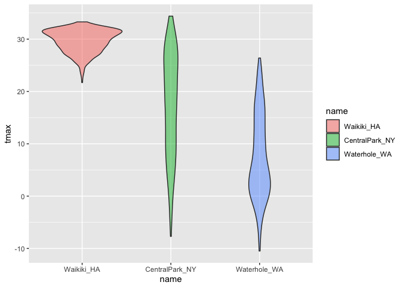

Visualization with ggplot pt. 2
================

``` r
library(tidyverse)
```

    ## ── Attaching packages ────────────────────────────────────────────────────── tidyverse 1.3.0 ──

    ## ✓ ggplot2 3.3.2     ✓ purrr   0.3.4
    ## ✓ tibble  3.0.3     ✓ dplyr   1.0.2
    ## ✓ tidyr   1.1.2     ✓ stringr 1.4.0
    ## ✓ readr   1.3.1     ✓ forcats 0.5.0

    ## ── Conflicts ───────────────────────────────────────────────────────── tidyverse_conflicts() ──
    ## x dplyr::filter() masks stats::filter()
    ## x dplyr::lag()    masks stats::lag()

``` r
library(patchwork)
```

## Load weather dataset

``` r
weather_df = 
  rnoaa::meteo_pull_monitors(
    c("USW00094728", "USC00519397", "USS0023B17S"),
    var = c("PRCP", "TMIN", "TMAX"), 
    date_min = "2017-01-01",
    date_max = "2017-12-31") %>%
  mutate(
    name = recode(
      id, 
      USW00094728 = "CentralPark_NY", 
      USC00519397 = "Waikiki_HA",
      USS0023B17S = "Waterhole_WA"),
    tmin = tmin / 10,
    tmax = tmax / 10) %>%
  select(name, id, everything())
```

    ## Registered S3 method overwritten by 'hoardr':
    ##   method           from
    ##   print.cache_info httr

    ## using cached file: /Users/rebekahhughes/Library/Caches/R/noaa_ghcnd/USW00094728.dly

    ## date created (size, mb): 2020-10-03 09:23:25 (7.522)

    ## file min/max dates: 1869-01-01 / 2020-10-31

    ## using cached file: /Users/rebekahhughes/Library/Caches/R/noaa_ghcnd/USC00519397.dly

    ## date created (size, mb): 2020-10-03 09:23:31 (1.699)

    ## file min/max dates: 1965-01-01 / 2020-03-31

    ## using cached file: /Users/rebekahhughes/Library/Caches/R/noaa_ghcnd/USS0023B17S.dly

    ## date created (size, mb): 2020-10-03 09:23:34 (0.88)

    ## file min/max dates: 1999-09-01 / 2020-10-31

## Remember this plot

``` r
weather_df %>% 
  ggplot(aes(x = tmin, y = tmax, color = name)) +
  geom_point(alpha = .5)
```

    ## Warning: Removed 15 rows containing missing values (geom_point).

<!-- -->

\#\#Labels

``` r
weather_df %>% 
  ggplot(aes(x = tmin, y = tmax, color = name)) +
  geom_point(alpha = .5) +
  labs(
    title = "Temperature Plot",
    x = "Minimum Daily Temperature",
    y = "Maximum Daily Temperature",
    caption = "Data frm the rnoaa package; temperatures in 2017"
  )
```

    ## Warning: Removed 15 rows containing missing values (geom_point).

<!-- -->

## Scales

Start with the same plot:

``` r
 weather_df %>% 
  ggplot(aes(x = tmin, y = tmax, color = name)) +
  geom_point(alpha = .5) +
  labs(
    title = "Temperature Plot",
    x = "Minimum Daily Temperature",
    y = "Maximum Daily Temperature",
    caption = "Data frm the rnoaa package; temperatures in 2017"
  ) +
  scale_x_continuous(
    breaks = c(-15, 0, 15),
    labels = c("-15C", "OC", "15C")
  ) +
  scale_y_continuous(
    trans = "sqrt"
  )
```

    ## Warning in self$trans$transform(x): NaNs produced

    ## Warning: Transformation introduced infinite values in continuous y-axis

    ## Warning: Removed 90 rows containing missing values (geom_point).

<!-- -->

Look at color scales:

``` r
 weather_df %>% 
  ggplot(aes(x = tmin, y = tmax, color = name)) +
  geom_point(alpha = .5) +
  labs(
    title = "Temperature Plot",
    x = "Minimum Daily Temperature",
    y = "Maximum Daily Temperature",
    caption = "Data frm the rnoaa package; temperatures in 2017"
  ) +
  scale_color_hue(
    name = "Location",
    h = c(100, 300))
```

    ## Warning: Removed 15 rows containing missing values (geom_point).

<!-- -->

``` r
 weather_df %>% 
  ggplot(aes(x = tmin, y = tmax, color = name)) +
  geom_point(alpha = .5) +
  labs(
    title = "Temperature Plot",
    x = "Minimum Daily Temperature",
    y = "Maximum Daily Temperature",
    caption = "Data frm the rnoaa package; temperatures in 2017"
  ) +
  viridis::scale_color_viridis(
    name = "Location",
    discrete = TRUE)
```

    ## Warning: Removed 15 rows containing missing values (geom_point).

<!-- -->

## Themes

Shift the legend and change overall theme:

``` r
 weather_df %>% 
  ggplot(aes(x = tmin, y = tmax, color = name)) +
  geom_point(alpha = .5) +
  labs(
    title = "Temperature Plot",
    x = "Minimum Daily Temperature",
    y = "Maximum Daily Temperature",
    caption = "Data frm the rnoaa package; temperatures in 2017"
  ) +
  viridis::scale_color_viridis(
    name = "Location",
    discrete = TRUE) +
  theme(legend.position = "bottom")
```

    ## Warning: Removed 15 rows containing missing values (geom_point).

<!-- -->

``` r
 weather_df %>% 
  ggplot(aes(x = tmin, y = tmax, color = name)) +
  geom_point(alpha = .5) +
  labs(
    title = "Temperature Plot",
    x = "Minimum Daily Temperature",
    y = "Maximum Daily Temperature",
    caption = "Data frm the rnoaa package; temperatures in 2017"
  ) +
  viridis::scale_color_viridis(
    name = "Location",
    discrete = TRUE) +
   theme_minimal()
```

    ## Warning: Removed 15 rows containing missing values (geom_point).

<!-- -->

``` r
  weather_df %>% 
  ggplot(aes(x = tmin, y = tmax, color = name)) +
  geom_point(alpha = .5) +
  labs(
    title = "Temperature Plot",
    x = "Minimum Daily Temperature",
    y = "Maximum Daily Temperature",
    caption = "Data frm the rnoaa package; temperatures in 2017"
  ) +
  viridis::scale_color_viridis(
    name = "Location",
    discrete = TRUE) +
  theme_classic()
```

    ## Warning: Removed 15 rows containing missing values (geom_point).

<!-- -->

``` r
  weather_df %>% 
  ggplot(aes(x = tmin, y = tmax, color = name)) +
  geom_point(alpha = .5) +
  labs(
    title = "Temperature Plot",
    x = "Minimum Daily Temperature",
    y = "Maximum Daily Temperature",
    caption = "Data frm the rnoaa package; temperatures in 2017"
  ) +
  viridis::scale_color_viridis(
    name = "Location",
    discrete = TRUE) +
  ggthemes::theme_excel()
```

    ## Warning: Removed 15 rows containing missing values (geom_point).

<!-- -->

``` r
 weather_df %>% 
  ggplot(aes(x = tmin, y = tmax, color = name)) +
  geom_point(alpha = .5) +
  labs(
    title = "Temperature Plot",
    x = "Minimum Daily Temperature",
    y = "Maximum Daily Temperature",
    caption = "Data frm the rnoaa package; temperatures in 2017"
  ) +
  viridis::scale_color_viridis(
    name = "Location",
    discrete = TRUE) +
   theme_minimal() +
  theme(legend.position = "bottom")
```

    ## Warning: Removed 15 rows containing missing values (geom_point).

<!-- -->

## Setting options

Would do this to set the visual appearance at the beginning of your
document.

``` r
library(tidyverse)

knitr::opts_chunk$set(
  fig.width = 6,
  fig.asp = .6,
  out.width = "90%"
)

theme_set(theme_minimal()+theme(legend.position = "bottom"))

options(
  ggplot2.continuous.color = "viridis",
  ggplot2.continuous.fill = "viridis"
)

scale_color_discrete = scale_color_viridis_d
scale_fill_discrete = scale_fill_viridis_d
```

## Data args in geom

``` r
central_park =
  weather_df %>% 
  filter(name == "CentralPark_NY")

waikiki =
  weather_df %>% 
  filter(name == "Waikiki_HA")

ggplot(data = waikiki, aes(x = date, y = tmax, color = name)) +
  geom_point() +
  geom_line(data = central_park)
```

    ## Warning: Removed 3 rows containing missing values (geom_point).

<!-- -->

## Patchwork

Remember faceting?

``` r
weather_df %>% 
  ggplot(aes(x = tmin, fill = name)) +
  geom_density(alpha = .5) +
  facet_grid(. ~ name)
```

    ## Warning: Removed 15 rows containing non-finite values (stat_density).

<!-- -->

What happens when you want multi-panel plots but can’t facet?

``` r
tmax_tmin_plot =
  weather_df %>% 
  ggplot(aes(x = tmin, y = tmax, color = name)) +
  geom_point(alpha = .5) +
  theme(legend.position = "none")

precip_dens_plot =
  weather_df %>% 
  filter(prcp>0) %>% 
  ggplot(aes(x = prcp, fill = name)) +
  geom_density(alpha = .5)

tmax_dates_plt =
  weather_df %>% 
  ggplot(aes(x = date, y = tmax, color = name)) +
  geom_point() +
  geom_smooth(se = FALSE) +
  theme(legend.position = "none")

(tmax_tmin_plot + precip_dens_plot) / tmax_dates_plt
```

    ## Warning: Removed 15 rows containing missing values (geom_point).

    ## `geom_smooth()` using method = 'loess' and formula 'y ~ x'

    ## Warning: Removed 3 rows containing non-finite values (stat_smooth).

    ## Warning: Removed 3 rows containing missing values (geom_point).

<!-- -->

## Data manipulation

Control the factors:

``` r
weather_df %>% 
  mutate(
    name = factor(name),
    name = forcats::fct_relevel(name, c("Waikiki_HA"))
  ) %>% 
  ggplot(aes(x = name, y = tmax, fill = name)) +
  geom_violin(alpha = .5)
```

    ## Warning: Removed 3 rows containing non-finite values (stat_ydensity).

<!-- -->

What if I wanted densities for tmin and tmax simultaneously?

``` r
weather_df %>% 
  filter(name == "CentralPark_NY") %>% 
  pivot_longer(
    tmax:tmin,
    names_to = "observation",
    values_to = "temperatures"
  ) %>% 
  ggplot(aes(x = temperatures, fill = observation)) +
  geom_density(alpha = .5)
```

<!-- -->

``` r
weather_df %>% 
  pivot_longer(
    tmax:tmin,
    names_to = "observation",
    values_to = "temperatures"
  ) %>% 
  ggplot(aes(x = temperatures, fill = observation)) +
  geom_density(alpha = .5) +
  facet_grid(. ~ name)
```

    ## Warning: Removed 18 rows containing non-finite values (stat_density).

<!-- -->

## Revisit the pups

Data from the fetal alcohol syndrome study.

``` r
pups_data =
  read_csv("./data/FAS_pups.csv") %>% 
  janitor::clean_names() %>% 
  mutate(sex = recode(sex, `1` ="male", `2`="female"))
```

    ## Parsed with column specification:
    ## cols(
    ##   `Litter Number` = col_character(),
    ##   Sex = col_double(),
    ##   `PD ears` = col_double(),
    ##   `PD eyes` = col_double(),
    ##   `PD pivot` = col_double(),
    ##   `PD walk` = col_double()
    ## )

``` r
litters_df =
  read_csv("./data/FAS_litters.csv") %>% 
  janitor::clean_names() %>% 
  separate(group, into = c("dose", "day_of_tx"), sep = 3)
```

    ## Parsed with column specification:
    ## cols(
    ##   Group = col_character(),
    ##   `Litter Number` = col_character(),
    ##   `GD0 weight` = col_double(),
    ##   `GD18 weight` = col_double(),
    ##   `GD of Birth` = col_double(),
    ##   `Pups born alive` = col_double(),
    ##   `Pups dead @ birth` = col_double(),
    ##   `Pups survive` = col_double()
    ## )

``` r
fas_df =
  left_join(pups_data, litters_df, by = "litter_number")

fas_df %>%
  select(dose, day_of_tx, starts_with("pd_")) %>% 
  pivot_longer(
    pd_ears:pd_walk,
    names_to = "outcome",
    values_to = "pn_day"
  ) %>% 
  drop_na() %>% 
  mutate(outcome = forcats::fct_relevel(outcome, "pd_ears", "pd_pivot", "pd_walk", "pd_eyes")) %>% 
  ggplot(aes(x = dose, y = pn_day)) +
  geom_violin() +
  facet_grid(day_of_tx ~ outcome)
```

<!-- -->
